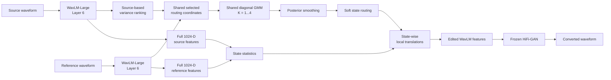

<div align="center">

# StateVC

### Shared-State Local Translations for Training-Free Voice Conversion

A lightweight, training-free one-shot voice conversion framework based on
**pair-specific shared acoustic states** and **local representation translation**.

<br>


</div>

---

## Overview

**StateVC** performs one-shot voice conversion without training an additional conversion model.

Given a source utterance and a target-speaker reference utterance, StateVC first constructs a
**shared pair-specific acoustic state space** using frozen WavLM representations.

It then estimates local source-to-reference transformations within the shared states and applies
them to the source representation before waveform synthesis.

The final system uses:

- frozen **WavLM-Large layer 6** representations;
- a **pair-specific shared diagonal GMM** for acoustic-state discovery;
- **soft state routing**;
- **state-wise mean translations** in the full WavLM feature space;
- a frozen **WavLM-conditioned HiFi-GAN** released with kNN-VC for synthesis.

No VC model is trained.

---

## Highlights

- **Training-free**  
  No adaptation or additional model training is required.

- **One-shot conversion**  
  Only one source utterance and one target reference utterance are needed.

- **Shared acoustic states**  
  Source and reference frames are organized using the same pair-specific latent state space.

- **Local rather than global conversion**  
  Different acoustic regions receive different source-to-reference transformations.

- **Soft routing**  
  Each source frame can combine transformations from multiple states.

- **Frozen pretrained backbone**  
  StateVC uses WavLM-Large and the kNN-VC HiFi-GAN backend without updating their parameters.

---

## Method



For source and reference WavLM representations

\[
H_s \in \mathbb{R}^{T_s \times 1024},
\qquad
H_r \in \mathbb{R}^{T_r \times 1024},
\]

StateVC first ranks feature coordinates according to the temporal variance of the source utterance.

The top \(d_c=24\) coordinates are used only for **state construction and routing**.

A shared diagonal GMM is fitted to the pooled routing representations

\[
Z =
\begin{bmatrix}
Z_s \\
Z_r
\end{bmatrix}.
\]

No source-reference frame alignment or equal-duration resampling is performed.

For each shared state \(k\), StateVC estimates posterior-weighted full-space means

\[
\mu_{q,k}
=
\frac{
\sum_t \gamma_{t,k}^{(q)} H_{q,t}
}{
\sum_t \gamma_{t,k}^{(q)}
},
\qquad q \in \{s,r\}.
\]

The state-specific translation is

\[
\Delta_k = \mu_{r,k} - \mu_{s,k}.
\]

The final system uses soft routing:

\[
H'_{s,t}
=
H_{s,t}
+
\lambda
\sum_k
\hat{\gamma}^{(s)}_{t,k}
\Delta_k,
\]

with \(\lambda=1\).

The edited WavLM sequence is then synthesized directly using the frozen prematched
HiFi-GAN backend from kNN-VC.

---

## Final ICASSP Configuration

| Component | Setting |
|---|---|
| Representation | WavLM-Large layer 6 |
| Feature dimension | 1024 |
| Routing dimensions | 24 |
| Routing-coordinate selection | Source temporal variance |
| State model | Shared diagonal GMM |
| Candidate states | \(K \in \{1,2,3,4\}\) |
| GMM selection | BIC |
| Minimum pooled support | \(n_{\min}=20\) |
| Posterior smoothing | 5 frames |
| Minimum per-utterance state mass | \(m_{\min}=20\) |
| Main operator | Mean translation |
| Routing | Soft |
| Conversion strength | \(\lambda=1\) |
| Decoder | Frozen prematched kNN-VC HiFi-GAN |

> **Important:** the top-24 coordinates are used only to define the shared state space.
> State statistics and the final Mean transformation are computed in the complete 1024-D WavLM space.

---

## Installation

Clone the repository:

```bash
git clone git@github.com:eurecom-asp/StateVC.git
cd StateVC
```

Install StateVC:

```bash
pip install -e .
```

For development and testing:

```bash
pip install pytest
python -m pytest -q
```

The first inference run automatically loads the frozen kNN-VC backend through `torch.hub`,
including WavLM-Large and the prematched WavLM-conditioned HiFi-GAN checkpoint.

---

## Quick Start

### Single-pair conversion

```bash
python convert.py \
    --source /path/to/source.wav \
    --reference /path/to/reference.wav \
    --output outputs/statevc.wav \
    --device cuda
```

The default arguments already correspond to the final StateVC configuration:

```text
operator       = mean
routing        = soft
cluster_dim    = 24
K_max          = 4
n_min          = 20
m_min          = 20
smooth_window  = 5
strength       = 1.0
```

You can therefore also run:

```bash
bash scripts/run_final_mean.sh \
    /path/to/source.wav \
    /path/to/reference.wav \
    outputs/statevc.wav
```

---

## Output

For

```text
outputs/statevc.wav
```

StateVC also writes

```text
outputs/statevc.json
```

containing diagnostic information such as:

```json
{
  "k_eff": 3,
  "hard_support": [52, 41, 35],
  "routing_indices": [],
  "posterior_mass_source": [],
  "posterior_mass_reference": [],
  "operator": "mean",
  "routing": "soft",
  "strength": 1.0
}
```

This is useful for checking state selection and conversion behavior for individual source-reference pairs.

---

## Batch Conversion

Prepare a TSV manifest:

```text
source	reference	output
/path/src1.wav	/path/ref1.wav	outputs/001.wav
/path/src2.wav	/path/ref2.wav	outputs/002.wav
```

Then run:

```bash
python batch_convert.py \
    --manifest pairs.tsv \
    --device cuda
```

---

## Operator Analysis

The repository also includes the representation-transformation operators used in the paper analysis.

### Mean

The final StateVC system.

Each state applies a full-space mean translation:

\[
x'
=
x
+
\left(
\mu_{r,k}-\mu_{s,k}
\right).
\]

### Diagonal

Coordinate-wise Gaussian transformation:

\[
x'
=
\mu_{r,k}
+
(x-\mu_{s,k})
\odot
\sqrt{
\frac{
\sigma_{r,k}^{2}+\epsilon
}{
\sigma_{s,k}^{2}+\epsilon
}
}.
\]

### Block

The full WavLM representation is reordered according to source temporal variance and partitioned into
contiguous 2-D blocks.

Each block applies a Gaussian covariance transport map

\[
A
=
\Sigma_s^{-1/2}
\left(
\Sigma_s^{1/2}
\Sigma_r
\Sigma_s^{1/2}
\right)^{1/2}
\Sigma_s^{-1/2}.
\]

The Block operator is included for analysis and is **not** the default StateVC system.

Run all three operators on the same pair with:

```bash
bash scripts/run_operator_ablation.sh \
    source.wav \
    reference.wav \
    outputs/operators
```

This produces:

```text
outputs/operators/
├── mean.wav
├── mean.json
├── diagonal.wav
├── diagonal.json
├── block.wav
└── block.json
```

---

## Repository Structure

```text
StateVC/
├── statevc/
│   ├── backend.py
│   ├── config.py
│   ├── core.py
│   ├── gmm.py
│   ├── operators.py
│   └── states.py
│
├── scripts/
│   ├── run_final_mean.sh
│   └── run_operator_ablation.sh
│
├── tests/
│   └── test_statevc.py
│
├── convert.py
├── batch_convert.py
├── example_manifest.tsv
├── REPRODUCIBILITY.md
├── requirements.txt
└── pyproject.toml
```

---

## Reproducibility

The public implementation fixes the principal StateVC hyperparameters used in the ICASSP experiments.

The shared GMM uses:

```text
covariance_type = diag
random_state    = 0
n_init          = 3
max_iter        = 100
reg_covar       = 1e-4
init_params     = kmeans
```

A candidate GMM is considered valid only when every component receives at least

```text
n_min = 20
```

hard-assigned pooled frames.

Among valid candidates, StateVC selects the model with minimum BIC.

For the subsequent local transformations, source and reference states must independently have posterior mass

```text
m_min = 20
```

otherwise the system falls back to the utterance-level reference-minus-source mean translation.

Additional implementation details are documented in
[`REPRODUCIBILITY.md`](REPRODUCIBILITY.md).

---

## Backend

StateVC uses components released with
[kNN-VC](https://github.com/bshall/knn-vc):

- WavLM-Large feature encoder;
- prematched WavLM-conditioned HiFi-GAN.

The upstream implementation is pinned to:

```text
c616845c4e309e24d5927f15adbdf277a3d65358
```

StateVC uses kNN-VC only as a frozen representation and synthesis backend.

**No k-nearest-neighbor matching is performed by StateVC.**

---

## Tests

Run:

```bash
python -m pytest -q
```

The unit tests cover:

- posterior smoothing;
- source-derived variance ranking;
- shared-GMM support filtering;
- Mean-transform identity behavior;
- global-shift recovery;
- Gaussian covariance transport;
- output validity for all released operators.

---

## Citation

The ICASSP 2027 paper citation will be added after publication.

```bibtex
@inproceedings{statevc2027,
  title     = {StateVC: Shared-State Local Translations for Training-Free Voice Conversion},
  author    = {...},
  booktitle = {IEEE International Conference on Acoustics, Speech and Signal Processing},
  year      = {2027}
}
```

---

## Acknowledgements

StateVC builds on pretrained representations and synthesis components released by
[WavLM](https://github.com/microsoft/unilm/tree/master/wavlm)
and
[kNN-VC](https://github.com/bshall/knn-vc).

---

<div align="center">

**StateVC — Shared states, local transformations, no VC training.**

</div>
